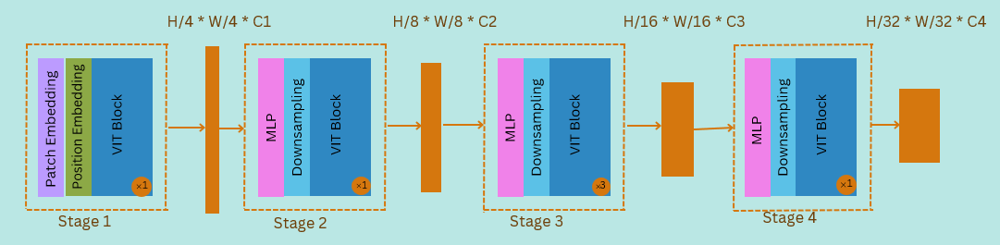
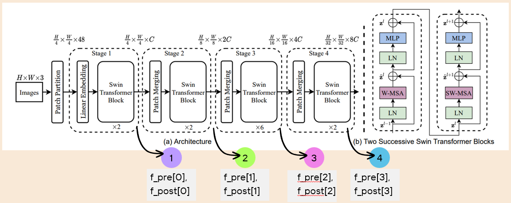
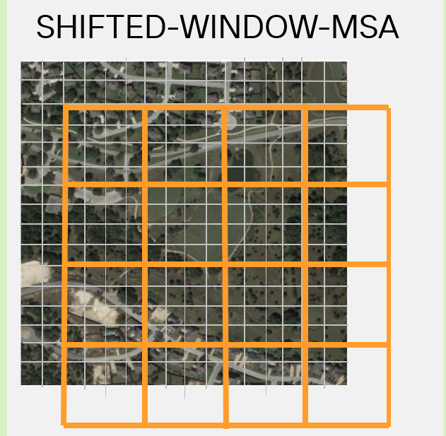
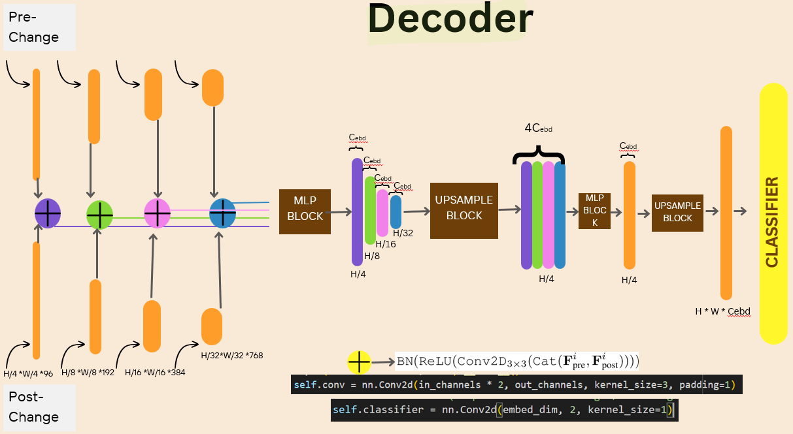
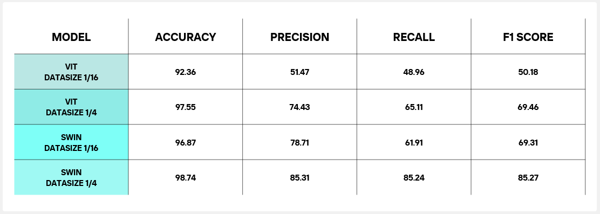

# Change Detection in Remote Sensed Images using Hierarchical Vision Transformers

**M.Tech Thesis | CSRE, IIT Bombay**

This repository contains the implementation and research findings of my M.Tech thesis conducted at the **Centre of Studies in Resources Engineering (CSRE), IIT Bombay**. The project focuses on detecting environmental or structural changes between bi-temporal remote sensing images using state-of-the-art Transformer architectures.

## 📌 Project Overview
The core objective was to develop and compare robust methods for change detection, specifically focusing on overcoming the limitations of standard Vision Transformers (ViT) when applied to satellite imagery.

### Key Architectures
* **Hierarchical Vision Transformer (ViT):** Utilizes a 4×4 patch-based encoder coupled with a custom-designed decoder to capture multi-scale spatial features.
* **Swin Transformer:** Implemented a shifted window attention encoder to improve local-global feature extraction efficiency.

---

## 🧠 Challenges Addressed
Standard Vision Transformers face significant hurdles in remote sensing. This thesis explores solutions for:
* **Inductive Bias:** Incorporating hierarchical structures to help the model understand spatial hierarchies without needing massive datasets.
* **Data-Hungry Nature:** ViTs usually require massive datasets; this study evaluates performance on smaller subsets.
* **Computational Expense:** Using shifted windows and hierarchical pooling to reduce the quadratic complexity of global self-attention.

---

## 📊 Experimental Setup & Results
A major part of the research involved testing how the models perform when data is scarce. We compared the standard ViT and Swin Transformer across two dataset scales:

| Dataset Size | Purpose |
| :--- | :--- |
| **1/16 of Data** | Testing model performance in extreme data-constrained environments. |
| **1/4 of Data** | Evaluating scaling behavior and feature representation quality. |

### Comparative Analysis
The results demonstrate that the **Hierarchical Swin-based architecture** significantly outperforms standard ViTs in extracting local textures and global context, especially when using the 1/4 data subset.

---

## 🖼️ Visualizations

### Model Encoder Architecture

*Figure 1: Hierarchical ViT with 4x4 patch-based encoder.*

*Figure 2: A Hierarchical ViT with Shifted Windows .*

### Understanding Shifted Window Concept

*Figure 3: Self-attention is computed independently within each 8×8 window.*

*Figure 4: Window is shifted to achieve Global attention .*

### Model Decoder Architecture

*Figure 5: A Common Decoder architecture.*

### Change Detection Results

*Figure 6: Comparison of results across different architectures and dataset sizes.*

---

## 🛠️ Tech Stack
* **Framework:** PyTorch
* **Models:** Vision Transformer (ViT), Swin Transformer
* **Domain:** Remote Sensing, Computer Vision
* **Tools:** GDAL, NumPy, Matplotlib

## 🎓 Acknowledgments
I would like to thank my advisors and the faculty at **CSRE, IIT Bombay** for their guidance throughout this Masters program.

---
**Author:** [Priya Das]  
**Contact:** [priya.das6499@gmail.com/https://www.linkedin.com/in/priya-das-liveyoung-livecurious/]
